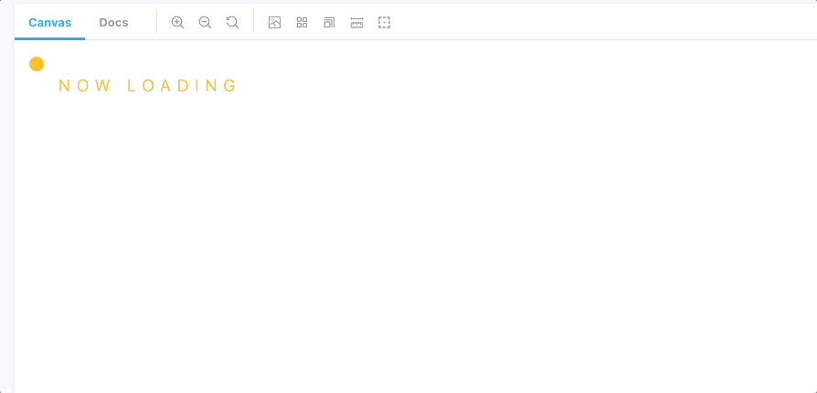

참고할만한 로딩 애니메이션을 찾아다니다가 다음과 같은 글을 보게 되었다.

> These days, if a website takes more than 4 seconds to load we tend to not even bother waiting; we simply close the page and find something else.

사람들은 웹 페이지를 로드하는데 4초가 넘어가면 못 견디고 나가버린다는 내용이었다. 😮

코드 로직을 변경해서 데이터 로드 시간을 줄이는 게 가장 좋은 방법이지만 해결이 어렵다면 웹 페이지 내용이 로딩 중일 때 재미있는 preloader를 만들어서 사용자가 떠나버리지 않게 붙잡는 방법도 있다.

참고 사이트에서 통통 튀는 공모양 preloader를 발견했는데, 가장 심플하고 재미있어서 tailwindcss로 비슷하게 만들어보았다.

1. **공 모양 만들기**

- `w-4` `h-4` `rounded-full` : 너비, 높이 16px의 원 모양을 만든다.

```html
<div className="absolute w-4 h-4 rounded-full bg-yellow-400 animate-bigBounce" />
```

2. **통통 튀는 bounce 애니메이션 만들기**

- `animate-bigBounce` : bitBounce라는 커스텀 애니메이션을 만든다.
- keyframes 설정

**0% :** 공이 바닥에 떨어졌을 때,

<div style="border:1px dashed;">
  
</div>

`border-radius: 60px 60px 20px 20px;` , `transform: scaleX(2);` `height: 5px;` css 속성을 적용해서 찌그러진 공모양을 만들어준다.

**35%:** 공이 바닥에서 35% 정도 올라갈 때,

<div style="border:1px dashed;">
  
</div>

`border-radius: 50%;` , `transform: scaleX(1)` css 속성을 이용해서 동그란 공모양을 만들어준다.

**100%:** 공이 바닥에서 100% 높이로 올라갈 때, `top: 0` 으로 공 위치를 잡아준다.

```json
 // tailwind.config.js

theme: {
	extend: {
		...,
		animation: {
        bigBounce: 'bigBounce 500ms alternate infinite ease',
      },
		keyframes: {
        bigBounce: {
          '0%': {
            top: '30px',
            height: '5px',
            borderRadius: '60px 60px 20px 20px',
            transform: 'scaleX(2)',
          },
          '35%': {
            height: '16px',
            borderRadius: '50%',
            transform: 'scaleX(1)',
          },
          '100%': {
            top: '0',
          },
        },
      },
	}
}
```

### 완성 ✨



```html
<div className="relative h-20 py-5">
  <div className="absolute w-4 h-4 rounded-full bg-yellow-400 animate-bigBounce" />
  <div className="text-yellow-400 text-lg font-light align-text-top ml-8 tracking-widest">
    NOW LOADING
  </div>
</div>
```

## Reference

- [top-30-most-captivating-preloaders-for-your-website](https://medium.muz.li/top-30-most-captivating-preloaders-for-your-website-95ed1beff99d)
