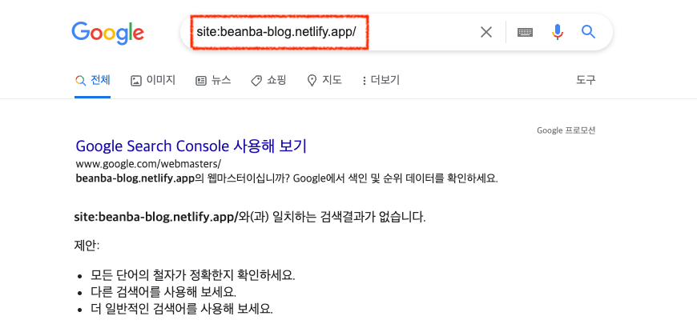
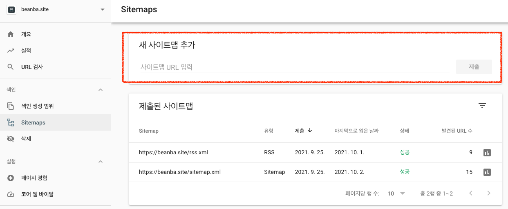
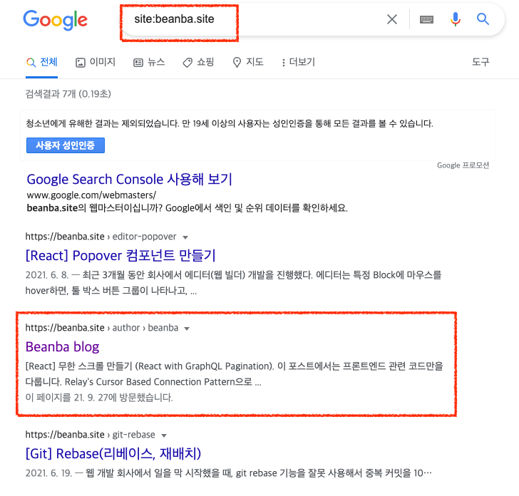

휑하던 블로그에 몇 개 글을 올리고 나니 이제 구글에서 내 블로그가 검색되면 좋겠다는 생각이 들었다.
그래서 Gatsby 블로그 SEO 작업을 시작했다. 🚀

## 1. 내 사이트가 Google에서 검색되는지 확인하기

당연히 안됨..😂


## 2. 로봇 텍스트 파일과 사이트맵 파일을 준비한다.

Gatsby SEO 관련 공식 문서([SEO with Gatsby](https://www.gatsbyjs.com/docs/how-to/adding-common-features/seo/))를 읽어보면 Gatsby pages는 서버 사이드 렌더링이기 때문에 페이지의 모든 내용을 Googlebot이나 다른 검색 엔진 봇이 사용 가능하다는 것을 알 수 있다.

**참고)** 클라이언트 사이드 렌더링은 초기 html에는 컨텐츠가 없는 빈 껍데기 상태이지만, 서버 사이드 렌더링의 경우 서버에서 컨텐츠를 포함한 html을 미리 그려서 보내준다.

SEO를 위해서는 텍스트 파일 형식의 로봇 텍스트 파일(robots.txt)과 xml 형식의 사이트맵 파일(sitemap.xml)이 필요하다. Gatsby는 해당 파일들을 쉽게 만들 수 있도록 plugin을 제공한다.

> gatsby-config.js 파일 `gatsby-plugin-robots-txt` 설치 확인

- 모든 크롤러에 대해 모든 URL을 오픈하도록 robots.txt 파일을 자동 생성해 준다.

```
User-agent: *
Allow: /
Sitemap: https://Mirabel.site/sitemap.xml
Host: https://Mirabel.site
```

- robots.txt 파일에서 특정 디렉토리는 검색이 되지 않도록 설정할 수도 있다. (Disallow 설정)
- robots.txt 파일에서 sitemap 파일의 위치를 포함시켜준다.
- gatsby build 진행 후, public 디렉토리 안 robots.txt 파일이 생성되었는지 확인한다.

> gatsby-config.js 파일 `gatsby-plugin-sitemap` 설치 확인

- 크롤링 이정표 역할을 하는 sitemap.xml 파일을 자동 생성해 준다.
- 사이트맵은 검색 엔진에 URL을 추가 혹은 배체하는 규약으로서 로봇 텍스트 파일을 보완하는 역할을 한다.
- 따라서 사이트맵 파일은 필수는 아니기 때문에 사이트맵이 필요한 경우는 [여기](https://developers.google.com/search/docs/advanced/sitemaps/overview?hl=ko)를 참고해보면 좋을 것 같다.
- gatsby build 진행 후, public 디렉토리 안 sitemap.xml 파일이 생성되었는지 확인하다.

## 3. 도메인 구매하기

- [beanba.site](http://beanba.site) (저는 가비아에서 할인하는 것으로 구매하였습니다.)
- Netlify에 구매한 도메인을 설정하고, DNS 정보를 확인한다.
- 가비아에 Netlify에서 확인한 DNS configuration 등록한다. ([DNS 레코드 설정 방법 가이드](https://customer.gabia.com/manual/dns/3041/3040))

## 4. Google Search Console 등록하기

- Google Search Console에 도메인을 등록한다.
- Google Search Console Sitemaps에 준비한 로봇 텍스트 파일과 사이트맵 파일을 추가한다.
- 제출하고 처음에는 빨간 글씨로 실패..! 에러..! 이런 문구가 떠 있었는데 2~3일 정도 기다리니까 성공으로 바뀌어 있었다.

  

## 5. 구글 검색 확인

- 구글에서 검색해 보니 블로그에 올렸던 글이 검색되는 것으 확인할 수 있었다!!!



## 마치며

- 지금은 `site:` 키워드로 검색해야 나오지만 포스트 내용 키워드로 검색해도 검색 결과 상위에 나올 수 있도록 열심히 해야겠다. 💪

## Reference

- [SEO with Gatsby](https://www.gatsbyjs.com/docs/how-to/adding-common-features/seo/)
