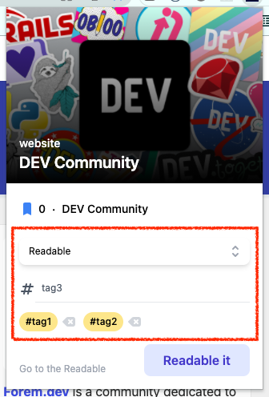

**react-hook-form**을 사용해서 사용자 입력 데이터를 서버로 전송하는 기능을 구현해보았다.

## 설치

```jsx
yarn add react-hook-form
```

## Form 영역



사용자가 입력하는 form 영역은 다음 사진에서 표시한 부분이다.<br />
Readable이라는 interest를 선택하고, tag1, tag2, tag3 태그를 추가한 후, 'Readable it' 이라고 적힌 버튼을 클릭하면 서버로 데이터가 전송되어야 한다.

## useForm

| useForm is custom hook for managing forms with ease.

우선, useForm 이라는 custom hook으로 default 값들을 지정해주었다.<br />
useForm의 return 값인 methods로 form 데이터를 관리할 수 있다.

```tsx
type FormValues = {
  tags: {
    name: string;
  }[];

  interests: {
    name: string;
  }[];

  selectedInterest: string;
};

const methods = useForm<FormValues>({
  defaultValues: {
    tags: userData.tags ?? [],
    interests: userData.interests ?? [{ name: 'Readable' }],
    selectedInterest: userData.selectedInterest ?? 'Readable',
  },
});
```

useForm으로 validation도 custom하게 설정할 수 있다. → [useForm 공식 문서](https://react-hook-form.com/api/useform/#main)

## useFormContext

Interest 입력 부분과 tag 입력 부분, 두 곳의 데이터를 전송해야하기 때문에 useFormContext를 사용했다.

`<FormProvider />` 에 useForm의 return 값인 methods를 넣어주고 `<Interests />`, `<HashTagInput />` 컴포넌트를 감싸주면 Interests와 HashTagInput 컴포넌트에서 `useFormContext()` hook으로 form 데이터를 공유 할 수 있다.<br />
(React에서 사용하는 Context와 기능, 사용법이 같고, 부모 컴포넌트에서 자식 컴포넌트로 props를 통해서 데이터를 전달하지 않아도 된다는 장점이 있다.)

```tsx
<FormProvider {...methods}>
  <div className="col-start-1 row-start-3 space-y-3 px-4 pb-4">
    <Interests />
    <HashTagInput />
  </div>
</FormProvider>
```

## useFieldArray

| Custom hook for working with uncontrolled Field Arrays (dynamic inputs).

react-hook-form에서 지원하는 useFieldArray hook을 사용하면 input을 추가하고, 삭제하는 기능을 정말 편하게 구현 할 수 있다.

우선, useFormContext로 context의 methods를 가져온 다음, useFieldArray에 **methods.control**과 **control 하고 싶은 form 데이터의 name**을 넘겨주면 fields 데이터, append, remove 함수등을 사용할 수 있게 된다.

```tsx
const methods = useFormContext();
const { register, control } = methods;

const { fields, append, remove, insert } = useFieldArray({
  name: 'tags',
  control,
});
```

fields에는 처음에 useForm을 통해 넣어준 default 값이 들어있다. 따라서 일단 fields 데이터를 화면에 뿌려준다. (태그 자체는 input이 아니기 때문에 input 태그를 hidden으로 넣어주었다.)

input 태그에 methods.register를 이용해서 등록을 해준다.

```tsx
<ul className="flex flex-wrap mb-4 text-sm font-medium max-h-32 overflow-y-auto">
  {fields.map((field, index) => {
    return (
      <li key={field.id} className="flex mr-2 mb-1">
        <Chip backgroundColor="bg-yellow-200" fontColor="text-black">
          <input {...register(`tags.${index}.name` as const)} className="hidden" />
          <>#{field['name']}</>
        </Chip>
        <button type="button" className="ml-1" onClick={() => remove(index)}>
          <BackspaceIcon className="w-5 h-5 text-gray-300 hover:text-gray-500"></BackspaceIcon>
        </button>
      </li>
    );
  })}
</ul>
```

태그를 입력하고 Enter를 치면 태그가 추가 되게끔 구현하고 싶었기 때문에 태그 입력 핸들러는 다음과 같이 작성하였다.

```tsx
const handleTagAddButtonClick = e => {
  const inputTagValue = tagInputRef.current.value;

  if (e.key === 'Enter' && inputTagValue) {
    append({ name: inputTagValue });
  }
};
```

## Submit

react-hook-form은 Enter 키를 입력하면 자동으로 submit 동작을 하게끔 구현되어있는 것 같았다.<br />
나는 Enter 키를 입력하면 태그를 추가하고 싶었을 뿐 submit 동작은 원하지 않았기 때문에
input 태그의 type을 button으로 지정해준 뒤 onClick으로 submit 핸들러가 동작하게끔 구현하였다.

```tsx
// Readable it 버튼
<input
  type="button"
  onClick={() => onSubmit()}
  className="bg-indigo-100 text-indigo-700 text-base font-semibold px-6 py-2 rounded-lg ml-auto disabled:opacity-50"
  value="Readable it"
/>
```

useForm의 return 값인 methods.getValues를 사용해서 form 데이터를 가져올 수 있다.

```tsx
// submit 핸들러
const onSubmit = () => {
  const { tags, selectedInterest } = getValues();
  submitData({ tags, interest: selectedInterest });
};
```

## 주의할 점

`<FormProvider />` 에 감싸진 `<button />` 태그들은 꼭 잊지말고 **type**을 지정해주어야한다.
예를 들어 `type="button"`이라고 지정해주지 않으면 엔터를 입력했을 때 제멋대로 submit 동작이 되는 문제가 생긴다.
