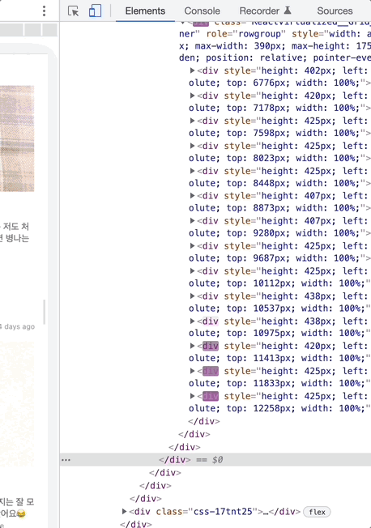

회사에서 커뮤니티 서비스를 개발하던 중 무한 스크롤에 virtual scrolling 기능을 적용해야 할 순간을 마주했다.
커뮤니티 서비스는 모바일 웹으로 제공되고 있었는데 무한 스크롤을 사용해서 데이터를 계속 불러오다 보면 모바일 화면에 백화현상이 일어났다. 😮

## 리액트 공식 문서 살펴보기

리액트 공식 문서에도 관련된 내용이 있었다. <br />
→ [Virtualize Long Lists](https://reactjs.org/docs/optimizing-performance.html#virtualize-long-lists)

100개 또는 1000개 이상의 데이터를 가지는 긴 리스트에서는 "windowing" 기술을 추천한다는 내용이다. "windowing" 기술을 사용하면 컴포넌트의 re-render 시간과 DOM 노드 생성을 효과적으로 줄일 수 있다고 한다.

windowing 라이브러리 중 **react-window**와 **react-virtualized** 라이브러리가 유명하다는 정보도 얻을 수 있었다.

## react-window VS react-virtualized

**react-window**와 **react-virtualized** 중 무엇을 써야 할까<br/>
우선, react-window의 build size가 react-virtualized build size 보다 15배가 작다. 따라서 가능하다면 react-window를 사용하는 것이 좋다. 하지만 react-window는 react-virtualized의 기능 중 일부만을 제공한다.
특히 react-window는 list를 구성하는 item들의 size(width, height)를 고정해야 하는데 react-virtualized의 경우 `<CellMeasurer />`라는 컴포넌트를 제공해서 Dynamic item sizing 기능을 제공한다.

커뮤니티 서비스에서 list item들의 size는 item 내용에 따라 달랐기 때문에 size 고정이 불가능했다. 따라서 react-virtualized를 사용하기로 결정했다.

## windowing <br /> (aka virtualizing)

windowing 기법은 화면에 보이는 list의 item만 DOM에 만들기 때문에 무한 스크롤을 적용한 리스트처럼 긴 리스트의 성능을 효과적으로 향상시킨다.
실제로 react-virtualized를 적용한 후 개발자 도구를 통해 확인해 보면 이해하기가 쉽다.<br />
스크롤을 내려서 데이터를 계속해서 불러와도 DOM의 개수가 일정하게 유지되는 것을 확인할 수 있다.



DOM을 보면 list의 item들이 innerScrollContainer로 감싸져 있는 것을 알 수 있는데 스크롤을 내리면 innerScrollContainer의 height는 계속 커진다. 그래서 DOM에 있던 item이 사라져도 스크롤의 길이와 위치는 유지된다.

기존 리스트 구현에 react-virtualized 라이브러리를 적용한 후 모바일 웹에서 스크롤을 끝까지 내려도 백화현상이 일어나지 않았다!

## react-virtualized CellMeasurerCache를 활용해서 한번 더 최적화하기

`<CellMeasurer />` 컴포넌트를 사용하면 리스트를 두 번 렌더링 한다. (debugger로 확인해 볼 수 있다!)
첫 번째 렌더링에서는 list item들의 size를 측정하고, 두 번째 렌더링에서는 측정한 사이즈를 기반으로 list item들을 렌더링한다.

렌더링이 두 번 되기 때문에 virtualizing 기능을 사용하면 item 렌더링 속도가 느리다는 단점이 있다. 따라서 **CellMeasurerCache** 기능을 잘 활용해야 한다.

CellMeasurerCache는 첫 번째 렌더링 때 측정한 데이터를 저장한다. CellMeasurerCache에 key 값이 저장되어 있는 item 컴포넌트는 size 측정을 위해 두 번 렌더링 되지 않는다.

CellMeasurerCache는 Public Methods로 `clear()`, `clearAll()`을 가지고 있다. CellMeasurerCache 데이터를 지우는 기능을 적당한 시점에 잘 써주지 않으면 당황스러운 결과를 얻을 수 있다.

**예 1) 모바일 기기가 가로모드에서 세로모드로 바뀔 때** <br />
가로모드에서 측정한 데이터가 세로모드에서 그대로 적용되어서 list의 UI가 깨진다. 따라서 resize 이벤트가 발생했을 때 CellMeasurerCache를 clear 해주었다.

**예 2) 리스트에 필터 기능이 있다면, 필터 조건을 변경했을 때 (최신순, 인기순 정렬 등)** <br />
필터 조건을 변경해서 list의 item들이 달라졌는데 CellMeasurerCache 데이터는 그대로이기 때문에 list의 특정 item UI가 깨질 수 있다. 그렇다고 유저가 필터 조건을 변경할 때마다 CellMeasurerCache를 clear해버리면 유저는 매번 느린 렌더링 속도를 경험해야한다. 이것을 해결하기위해 **cellMeasurerCacheMap**을 만들어서 사용했다.부모 컴포넌트에서 cellMeasurerCacheMap의 key를 prop으로 전달 받았다. 그리고 list가 cellMeasurerCacheMap에서 key에 맞는 cache 데이터를 가져와서 사용할 수 있도록 하였다.

아래 코드는 cellMeasurerCacheMap의 쉬운 이해를 위해 간단하게 표현한 코드이다.

```typescript
["인기순", [{height: 100px, ...}, { item size... }, { item size...}]]
["최신순", [{height: 50px, ...}, { item size... }, { item size... }]]
...
```

실제 코드는 다음과 같이 작성하였다.

```typescript
const cellMeasurerCacheMap = new Map();

const selectCellMeasurerCache = (cellMeasurerCacheKey: string) => {
  if (!cellMeasurerCacheMap.has(cellMeasurerCacheKey)) {
    cellMeasurerCacheMap.set(
      cellMeasurerCacheKey,
      new CellMeasurerCache({ defaultHeight: 500, minHeight: 100, fixedWidth: true }),
    );
  }

  return cellMeasurerCacheMap.get(cellMeasurerCacheKey);
};

const cellMeasurerCache = useMemo(() => {
  return selectCellMeasurerCache(cellMeasurerCacheKey);
}, [cellMeasurerCacheKey]);
```

## 마치며

무한 스크롤에 데이터가 수 백 개 이상일 때를 다뤄본 적은 없어서 그동안 성능 최적화에 대해서 고민해 본 적이 없었다. 하지만 모바일 웹에서 성능 최적화는 선택이 아닌 필수였다. 성능 최적화가 되지 않으면 백화현상처럼 서비스가 아예 마비되버리는 현상이 자주 발생했기 때문이다.
그렇다고 모든 list에 virtualizing 기능을 무조건 적용해야 하는 것은 아니다. virtualizing 기능을 적용한 list는 스크롤을 내려서 처음 렌더링 하는 item을 만나면 두 번 렌더링하는 것을 피할 수 없기 때문에 느리다. 하지만 virtualizing 기능을 적용하지 않은 리스트는 최초에 전체 item을 렌더링 하는데 시간이 걸릴 수는 있지만 이후에는 유저가 기다리는 시간이 없어진다. 한 번에 DOM에 그려도 문제없는 양의 item을 가지는 list에는 굳이 virtualizing 기능을 적용하지 않아도 된다고 생각한다.

## Reference

- [블로그] [Windowing wars: React-virtualized vs. react-window](https://blog.logrocket.com/windowing-wars-react-virtualized-vs-react-window/)

- [공식 문서] [react-virtualized CellMeasurer](https://github.com/bvaughn/react-virtualized/blob/master/docs/CellMeasurer.md)
