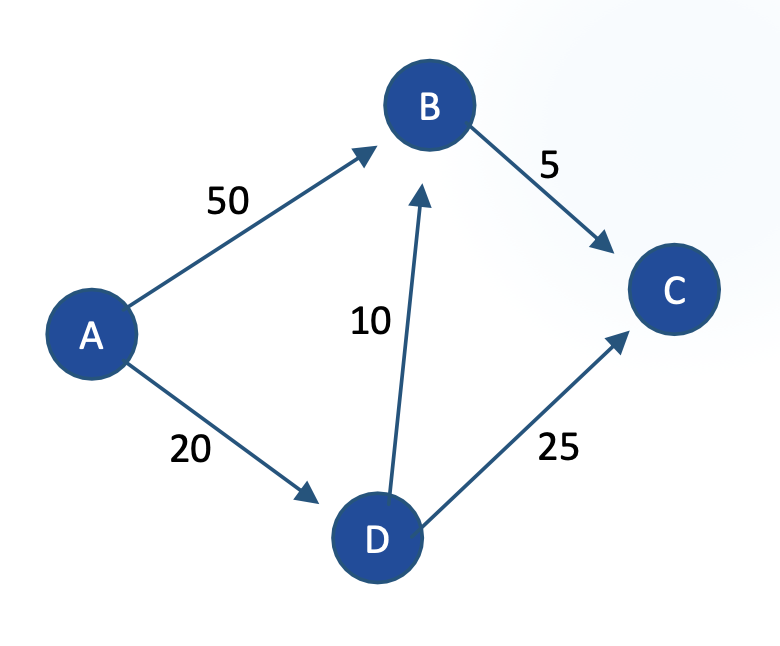

| 프로그래머스 level3 문제 : [프로그래머스 - 합승 택시 요금](https://programmers.co.kr/learn/courses/30/lessons/72413)

n이 최대 200이 될 수 있다는 것을 보고 이 문제는 재귀로 풀 수 없다는 것을 알았다. 다익스트라 알고리즘으로 접근해야 한다는 느낌이 있었지만.. 정말 느낌만 있었을 뿐 다익스트라 알고리즘에 대한 기억이 나지 않았다..ㅎ 다시 공부한 김에 미래의 나를 위해 블로그에 기록을 남겨놓는다!

## 다익스트라 알고리즘

- 재귀 호출 없이 최단거리(최소비용)를 구하는 알고리즘이다.
- 사용 예 : 지하철 노선도에서 최단 경로를 알려주는 프로그램

## 다익스트라 알고리즘 원리

합승 택시 요금 카카오 문제를 풀기 전에 간단한 다익스트라 알고리즘 문제를 풀어보면 도움이 많이 된다.



위 그림에서 A에서 C까지 가는 최소 비용이 35만 원이라는 것은 눈으로 보면 쉽게 알 수 있다. (A → D → B → C)

이 문제를 코드로 풀려고 하면 조금 까다롭다.. 차근 차근하면 할 수 있다.!

### 1. 출발 지점에서 각 노드까지 한번에 갈 수 있는 경로의 최소 비용을 적어둘 배열을 준비한다.

- 노드 수만큼 배열을 만들고, 출발 지점(A)에서 각 노드(A,B,C,D)까지 한번에 갈수 있는 경로의 최소 비용을 넣는다. 출발 지점에서 한번에 갈 수 없는 곳(A → C)은 NOT 처리 한다. (NOT은 가장 큰 수라고 생각하면 된다.)

|  A  |  B  |  C  |  D  |
| :-: | :-: | :-: | :-: |
|  0  | 50  | NOT | 20  |

### 2. 경유지 노드를 선택한다.

- 출발 지점에서 도착 지점에 가기 전 거쳐 갈 경유지 노드를 선택해야 한다.
- 출발 지점인 A를 제외하고 B, C, D 중에 골라야 하며 최소 비용으로 갈 수 있는 곳을 고른다.
- 위 배열에서 D가 20이기 때문에 처음 경유지로 선택되는 노드는 D이다.

### 3. 출발 지점에서 도착 지점으로 바로 가는 경우와 출발 지점에서 경유지를 거쳐 도착지점을 가는 경우를 비교한다.

- 위 배열을 순회하면서 출발점에서 해당 노드까지 바로 가는 것이 저렴한지 출발점에서 해당 노드까지 경유지를 거쳐 가는 것이 저렴한지 비교해서 <mark>더 저렴한 값</mark>으로 배열 값을 변경한다.

|  A  |  B  |  C  |  D  |
| :-: | :-: | :-: | :-: |
|  0  | 35  | 45  | 20  |

**A** : 출발 지점이므로 비용은 언제나 0

**B** : `A → B` VS `A → D → B` = `50` VS `20 + 10 = 30`

**C** : `A → C` VS `A → D → C` = `NOT` VS `20 + 25 = 45`

**D** : `A → D` VS `A → D → D` = `20` VS `20 + 0 = 20`

### 4. 출발 지점을 제외하고 모든 노드가 한번씩 경유지로 선택될 수 있도록 위에 과정을 반복한다.

- A는 출발 지점이고, D는 경유지로 선택된 적이 있었으므로 B, C 중에서 비용이 더 저렴한 **B를 다음 경유지로 선택한다.**

|  A  |  B  |  C  |  D  |
| :-: | :-: | :-: | :-: |
|  0  | 30  | 35  | 20  |

A : 출발 지점이므로 비용은 언제나 0

B : `A → B` VS `A → B → B` = `30` VS `30 + 0 = 30`

C : `A → C` VS `A → B → C` = `45` VS `30 + 5 = 35`

D : `A → D` VS `A → B → D` = `20` VS `30 + NOT = 20`

- **마지막 경유지 C 선택**

|  A  |  B  |  C  |  D  |
| :-: | :-: | :-: | :-: |
|  0  | 30  | 35  | 20  |

A : 출발 지점이므로 비용은 언제나 0

B : `A → B` VS `A → C → B` = `30` VS `35 + NOT = 30`

C : `A → C` VS `A → C → C` = `35` VS `35 + 0 = 35`

D : `A → D` VS `A → C → D` = `20` VS `35 + NOT = 20`

### 5. 결과

|  A  |  B  |  C  |  D  |
| :-: | :-: | :-: | :-: |
|  0  | 30  | 35  | 20  |

- 다음 결과는 출발 지점 A에서 각 노드까지 이동하는데 필요한 최소비용을 의미한다.
- 따라서 A → C까지의 최소비용은 35라는 것을 알 수 있다.

---

## 2021 KAKAO BLIND RECUITMENT<br />합승 택시 요금 문제 풀이

### 설계

- 모든 노드를 출발 지점으로 해서 최소 비용 배열을 만든다. → 위 기본 예제 참고!

  ex) 1번 노드가 출발점인 경우 2, 3, 4, ...로 갈 수 있는 최소 비용, 2번 노드가 출발점인 경우 1, 3, 4, ...로 갈 수 있는 최소 비용 ...

- 1번까지 동승한 경우, 2번까지 동승한 경우, 3번까지 동승한 경우 ... 최소 비용을 구한다.
- 동승하지 않은 경우 최소 비용을 구한다.
- 가장 최솟값이 답!

### 코드

```javascript
function solution(n, s, a, b, fares) {
  let answer = Number.MAX_SAFE_INTEGER;

  let faresBoard = [...new Array(n)].map(() => new Array(n).fill(Number.MAX_SAFE_INTEGER));

  fares.forEach(fare => {
    faresBoard[fare[0] - 1][fare[1] - 1] = fare[2];
    faresBoard[fare[1] - 1][fare[0] - 1] = fare[2];
  });

  // 다익스트라
  // n개의 최소비용 배열 만들기
  let minFaresBoard = [...new Array(n)].map((_, startPoint) =>
    [...new Array(n)].map((_, index) => faresBoard[startPoint][index]),
  );

  // 경유지 찾는 함수
  const findStopover = (startPoint, via) => {
    let minValue = Number.MAX_SAFE_INTEGER;
    let minIndex = 0;

    minFaresBoard[startPoint].forEach((value, index) => {
      if (via[index] === 0 && value <= minValue) {
        minValue = value;
        minIndex = index;
      }
    });

    return minIndex;
  };

  for (let startPoint = 0; startPoint < n; startPoint++) {
    let via = new Array(n).fill(0);
    via[startPoint] = 1;

    // n번 째 최소비용 배열 업데이트
    for (let i = 0; i < n; i++) {
      const stopover = findStopover(startPoint, via);
      via[stopover] = 1;

      for (let j = 0; j < n; j++) {
        // 출발지와 도착지가 같은 경우
        if (startPoint === j) {
          minFaresBoard[startPoint][j] = 0;
          continue;
        }

        // 출발지 -> 경유지 -> 도착지
        const path1 = Math.min(
          minFaresBoard[startPoint][stopover] + faresBoard[stopover][j],
          Number.MAX_SAFE_INTEGER,
        );

        // 출발지 -> 도착지
        const path2 = minFaresBoard[startPoint][j];

        minFaresBoard[startPoint][j] = Math.min(path1, path2);
      }
    }
  }

  // 동승 경우의 수
  for (let i = 0; i < n; i++) {
    const aPerson = minFaresBoard[i][a - 1];
    const bPerson = minFaresBoard[i][b - 1];
    const share = minFaresBoard[s - 1][i];

    answer = Math.min(answer, aPerson + bPerson + share);
  }

  // 동승하지 않는 경우의 수
  answer = Math.min(answer, minFaresBoard[s - 1][a - 1] + minFaresBoard[s - 1][b - 1]);

  return answer;
}
```

## Reference

- 민코딩
